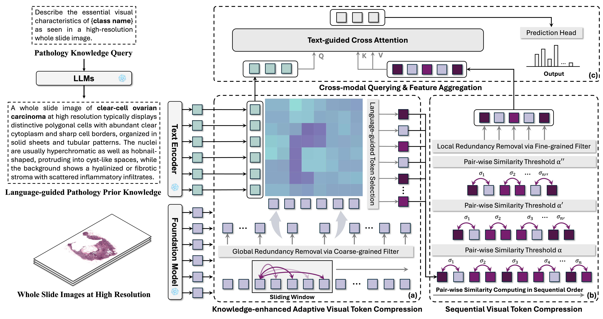

# FOCUS

FOCUS: Knowledge-enhanced Adaptive Visual Compression for Few-shot Whole Slide Image Classification, **CVPR 2025**\
*Zhengrui Guo, Conghao Xiong, Jiabo MA, Qichen Sun, Lishuang Feng, Jinzhuo Wang, Hao Chen*

[[ArXiv]](https://arxiv.org/abs/2411.14743) [[CVPR Proceedings]](https://openaccess.thecvf.com/content/CVPR2025/html/Guo_FOCUS_Knowledge-enhanced_Adaptive_Visual_Compression_for_Few-shot_Whole_Slide_Image_CVPR_2025_paper.html)



### News
- 2025.03.20: The model and training codes have been released!
- 2025.02.27: Our paper is accepted by CVPR 2025! 🎉

## 1. Installation
Please refer to [ViLa-MIL](https://github.com/Jiangbo-Shi/ViLa-MIL), [CLAM](https://github.com/mahmoodlab/CLAM), and [CONCH](https://github.com/mahmoodlab/CONCH).

## 2. Reproduce FOCUS
This repository is based on the Pytorch version of the FOCUS implementation.

We have provided the model implementation and training code, with detailed instructions shown as follows:

### 2.1 Dataset
We've inlcuded three datasets in this study, *i.e.*, TCGA-NSCLC, CAMELYON, and UBC-OCEAN. Here provides the download link to each dataset:
- TCGA-NSCLC: The TCGA-related subsets could be downloaded from [NIH Genomic Data Commons Data Portal](https://portal.gdc.cancer.gov/).
- CAMELYON: We used both [CAMELYON16](https://camelyon16.grand-challenge.org/Data/) and [CAMELYON17](https://camelyon17.grand-challenge.org/Data/).
- UBC-OCEAN: This dataset could be downloaded from [Kaggle](https://www.kaggle.com/competitions/UBC-OCEAN).

### 2.2 Preprocessing
For WSI preprocessing, please refer to [CLAM](https://github.com/mahmoodlab/CLAM), where we set the patch size to 512 and magnification to 40X.

For obtaining patch feature embeddings, please note that we use [CONCH](https://github.com/mahmoodlab/CONCH) as the feature extractor for experiments in this study.

For dataset splitting under few-shot settings, please refer to [ViLa-MIL](https://github.com/Jiangbo-Shi/ViLa-MIL). 

After the preprocessing steps above, assume that we have divided the dataset into 10 folds (we've provided the splits of three datasets we used in this study in the `splits` folder).

### 2.3 Training
🌟 Before training the model, please download the `conch.pth` checkpoint from our provided [HuggingFace Repo](https://huggingface.co/datasets/david4real/FOCUS/tree/main). After downloading, put it under the `ckpts` folder.

Please see `LUAD_LUSC.sh`, `camelyon.sh`, and `UBC-OCEAN.sh`. If you find any config confusing, please refer to [ViLa-MIL](https://github.com/Jiangbo-Shi/ViLa-MIL) for detailed description.

Note the `data_folder_s` argument is only used for models that need dual-scale WSI features (*e.g.*, ViLa-MIL). 

## Acknowledgment
This codebase is based on [ViLa-MIL](https://github.com/Jiangbo-Shi/ViLa-MIL) and [CLAM](https://github.com/mahmoodlab/CLAM). Many thanks to the authors of these great projects!

## Issues
- Please open new threads or report issues directly (for urgent blockers) to `zguobc@connect.ust.hk`
- Immediate response to minor issues may not be available

## Reference
If you find our work useful in your research, please consider citing our paper at::
```
@inproceedings{guo2025focus,
  title={Focus: Knowledge-enhanced adaptive visual compression for few-shot whole slide image classification},
  author={Guo, Zhengrui and Xiong, Conghao and Ma, Jiabo and Sun, Qichen and Feng, Lishuang and Wang, Jinzhuo and Chen, Hao},
  booktitle={Proceedings of the Computer Vision and Pattern Recognition Conference},
  pages={15590--15600},
  year={2025}
}
```